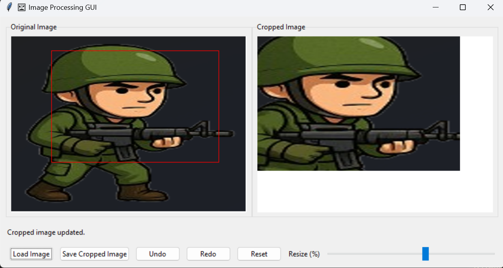
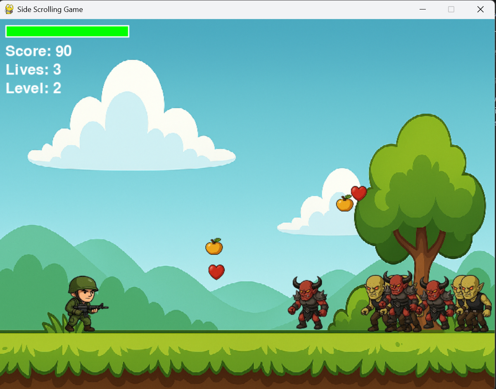

# HIT137-Group_SYD_17
This is the assessment repository for Software Now subject where Group 17 members will collaborate to complete all assignments. 

## Assessment 2
### To run the file

1. Open the terminal in the "Assessment2" folder.
2. Run the code using the following command:

### 1. For encryption and decryption 
```bash 
python enc_dec/enc_dec.py
 ```
The encrypted text is saved in enc_dec/result_files/encrypted_text.txt file. 

### 2. For Australian Temperature analysis 

 ```bash
 python temp_aus/temp_analysis.py
 ```
The analysis results of the temperature are saved inside temp_aus/analysis folder. 

### 3. To Draw Tree Pattern 

 ```bash
 python tree_pattern/tree_pattern_turtle.py
 ```
This is the tree pattern generated using following values: <br>
Left branch angle: 25   </br>
Right branch angle: 20  </br>
Starting branch length: 100 </br>
Recursion depth: 5 </br>
Branch length reduction factor(1-100): 70
</br></br>
 


 ## Assessment 3

### 1. Image Processing GUI (Question 1)

This desktop application shows GUI for image processing. It includes the following features:

1. **Image Loading**
   - Select and load images from your local device
   - Supports common image formats
   - Displays the loaded image in the application window

2. **Image Cropping**
   - Draw a selection rectangle using mouse interaction
   - View the cropped result alongside the original image

3. **Image Resizing**
   - Adjust the size of the cropped image using a slider control
   - Real-time preview as you adjust the size

4. **Save Functionality**
   - Save the modified image
   - Preserves the current crop and resize settings

5. **Undo and Redo**
   - Undo the last crop action
   - Redo the undone crop action



#### To Run the Application

1. Open the terminal in the "Assessment3" folder.
2. Install the required packages
    ```bash
    pip install -r requirements.txt
    ```
3. Run the command:
   ```bash
   python image_processing_gui.py
   ```

### 2. Side Scrolling Game (Question 2)

This is a side-scrolling game where the player navigates through levels, avoiding or defeating enemies, and collecting items.

#### How to Play

- **Objective**: Survive through levels by avoiding or defeating enemies and collecting items to increase your score and lives.
- **Controls**:
  - **Move Left/Right**: Use the arrow keys to move the player left or right.
  - **Jump**: Press the 'Up' arrow key to jump.
  - **Shoot**: Press 'F' to shoot projectiles at enemies.
- **Game Progression**:
  - The game consists of multiple levels, each with increasing difficulty.
  - Defeat all enemies in a level to progress to the next.
  - Collectibles like health and extra lives can be found throughout the levels.
- **Winning and Losing**:
  - Win by completing all levels.
  - Lose if you run out of lives.



#### To Run the Game

1. Open the terminal in the "Assessment3" folder.
2. Install the required packages if haven't
    ```bash
    pip install -r requirements.txt
    ```
3. Run the command:
   ```bash
   python side_scrolling_game.py
   ```
